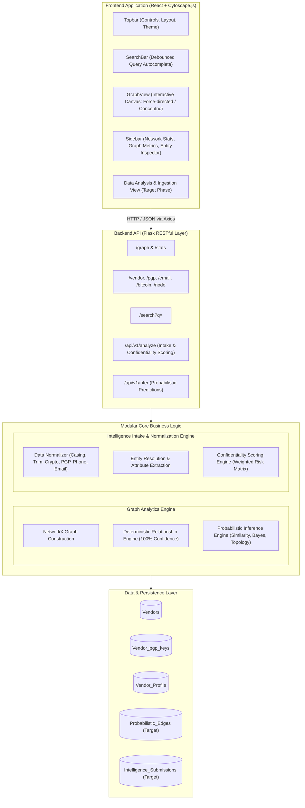
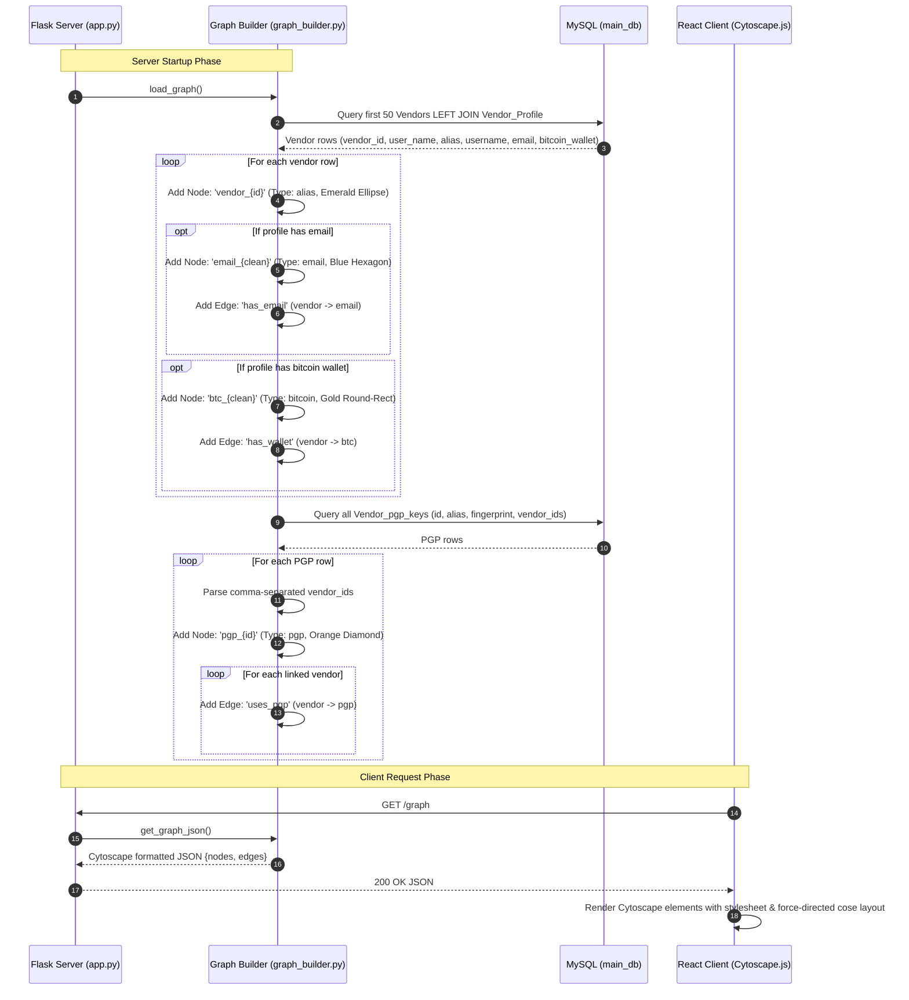
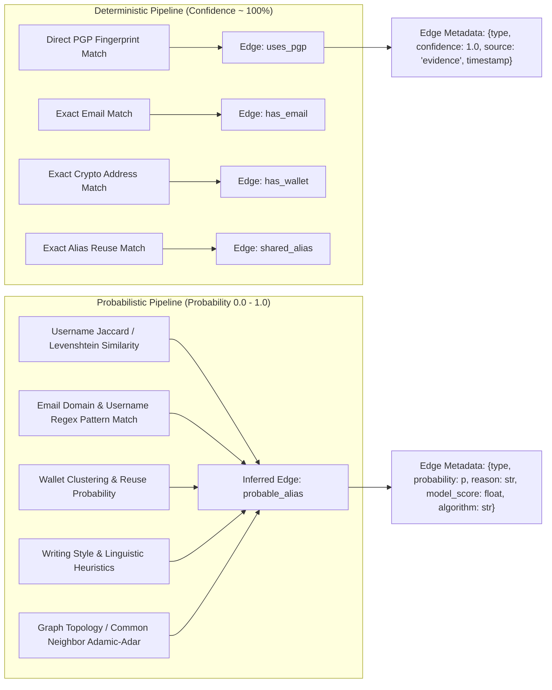
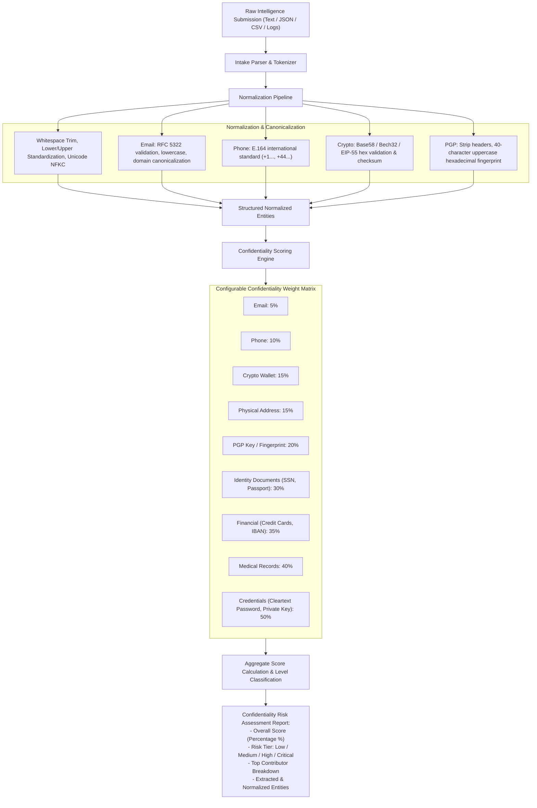
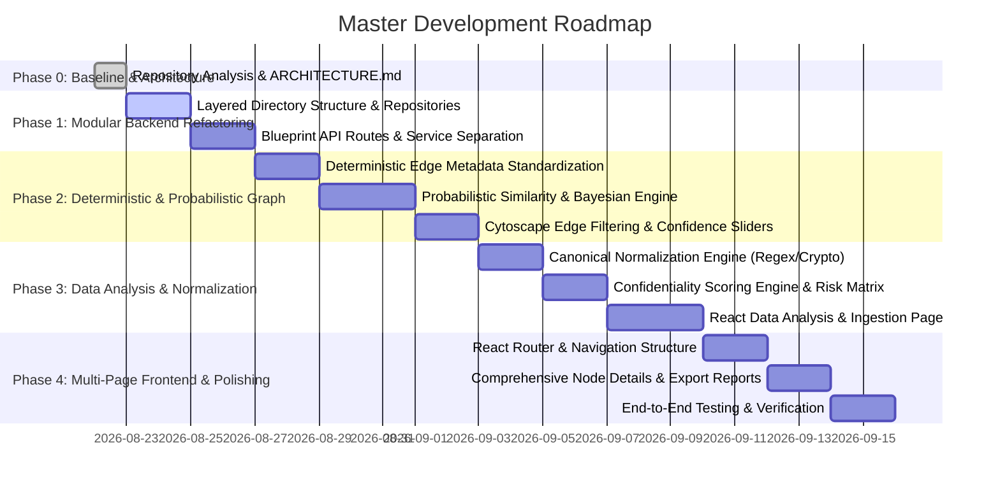

# System Architecture & Technical Specification

**Project:** Darknet Vendor Relationship Intelligence & Confidentiality Analysis Platform  
**Role:** Lead Software Architect & Senior AI Engineer  
**Status:** Comprehensive Baseline Architecture & Gap Analysis (Phase 0)  
**Target Deployment:** Hybrid Intelligence Web Platform (Academic Review / Production-Ready Architecture)

---

## 1. Executive Summary & System Vision

The **Darknet Vendor Relationship Intelligence Platform** is an AI-assisted cybersecurity intelligence and data confidentiality assessment application. It ingests, correlates, and analyzes disparate intelligence data points across darknet marketplaces, underground forums, and leaked databases to identify threat actor identities, uncover hidden vendor syndicates, and score confidentiality risks of compromised intelligence feeds.

The platform unites two foundational analytical pipelines:
1. **Deterministic Relationship Pipeline:** Direct, evidence-backed attribution graph connecting vendor aliases through shared cryptographic assets (PGP fingerprints), financial identifiers (Bitcoin/Monero addresses), communication channels (emails, XMPP), and marketplace profiles with near 100% confidence.
2. **Probabilistic Relationship & Inference Pipeline:** Multi-modal predictive graph analysis utilizing string similarity metrics (Jaccard, Levenshtein, N-gram), Bayesian inference, graph topology/community detection, and behavioral heuristics to predict hidden alias ownership, shared operating syndicates, and infrastructure reuse with quantifiable probability scores.

Complementing the graph intelligence is the **Data Analysis & Confidentiality Scoring Engine**, which ingests arbitrary unstructured and semi-structured intelligence documents (raw text, CSV, JSON, server logs), normalizes diverse entity types, extracts intelligence markers, and calculates aggregate and entity-level confidentiality risk scores based on configurable risk matrix weighting.

---

## 2. Repository & Project Structure

```text
vitsh/
│
├── ARCHITECTURE.md                  # Comprehensive architectural specification & roadmap
│
├── backend/                         # Flask Backend Application
│   ├── app.py                       # Flask entrypoint & route definitions
│   ├── config.py                    # Database and server configuration
│   ├── db.py                        # MySQL connection management
│   ├── generate_vendor_profiles.py  # Synthetic intelligence profile generator (Faker)
│   ├── graph_builder.py             # NetworkX graph construction, querying, & search
│   ├── requirements.txt             # Python package dependencies
│   └── README.md                    # Backend setup instructions & API notes
│
└── frontend/                        # React Frontend Application (Vite)
    ├── index.html                   # HTML entrypoint
    ├── package.json                 # Frontend dependencies & scripts
    ├── vite.config.js               # Vite build configuration
    ├── README.md                    # Frontend documentation
    ├── public/                      # Static assets & icons
    └── src/
        ├── main.jsx                 # React root render
        ├── App.jsx                  # Application shell & state orchestration
        ├── App.css                  # Base layout styles
        ├── index.css                # Global theme variables & typography
        ├── components/              # UI Components
        │   ├── GraphView.jsx        # Cytoscape.js visualization canvas
        │   ├── Sidebar.jsx          # Metric cards, node detail inspector, & legend
        │   ├── Topbar.jsx           # Graph control panel & theme toggle
        │   ├── SearchBar.jsx        # Debounced multi-entity search with suggestions
        │   ├── StatsCard.jsx        # Reusable metric badge
        │   └── Loading.jsx          # Loading spinner & backend error fallback
        ├── hooks/
        │   └── useDebounce.js       # Debounce hook for real-time search queries
        ├── services/
        │   └── api.js               # Axios API client
        └── styles/
            └── graph.css            # Component styles & design system
```

---

## 3. High-Level Architecture Diagram



---

## 4. Current Implementation vs. Target Vision Analysis

### 4.1 What Has Been Implemented (Verified in Codebase)

| Component | Status | Implementation Details |
| :--- | :--- | :--- |
| **MySQL Database** | **Implemented** | `Vendors`, `Vendor_pgp_keys`, and `Vendor_Profile` tables populated and queried via `mysql-connector-python`. |
| **Vendor Profile Generator** | **Implemented** | `generate_vendor_profiles.py` dynamically creates profiles with synthetic usernames, email addresses, and Bitcoin addresses mapped to vendor records. |
| **NetworkX Graph Engine** | **Implemented** | `graph_builder.py` constructs a heterogeneous graph with 4 distinct node classes (`alias`, `pgp`, `email`, `bitcoin`) and 3 edge types (`uses_pgp`, `has_email`, `has_wallet`). |
| **Flask API Server** | **Implemented** | `app.py` exposes REST endpoints for graph topology, summary stats, unified node lookups, entity-specific details, and real-time search. |
| **Cytoscape.js Visualization** | **Implemented** | `GraphView.jsx` provides interactive rendering with layout switching (`cose`, `concentric`, `circle`, `breadthfirst`, `grid`), hover neighborhood highlights, selection halo, and animated focus/zoom. |
| **Search & Discovery** | **Implemented** | Debounced search (`SearchBar.jsx`) matches across usernames, aliases, PGP fingerprints, emails, domains, and Bitcoin wallets with typed suggestion dropdowns. |
| **Inspector & Stats Sidebar** | **Implemented** | `Sidebar.jsx` displays aggregate node/edge counts, client-calculated graph metrics (connected components, density, avg degree), and detailed relationship breakdowns for selected nodes. |

---

## 5. Detailed Component Specifications

### 5.1 Database Schema Analysis

#### Current Schema (as utilized in Python modules)
```sql
-- 1. Vendors Table
CREATE TABLE Vendors (
    vendor_id INT PRIMARY KEY AUTO_INCREMENT,
    user_name VARCHAR(255) NOT NULL
);

-- 2. Vendor PGP Keys Table
CREATE TABLE Vendor_pgp_keys (
    id INT PRIMARY KEY AUTO_INCREMENT,
    alias VARCHAR(255),
    fingerprint VARCHAR(255),
    vendor_ids TEXT -- Comma-separated list of vendor_id foreign references
);

-- 3. Vendor Profile Table
CREATE TABLE Vendor_Profile (
    vendor_id INT PRIMARY KEY,
    alias VARCHAR(255),
    username VARCHAR(255),
    email VARCHAR(255) NULL,
    bitcoin_wallet VARCHAR(64) NULL,
    CONSTRAINT fk_vendor_profile_vendor
        FOREIGN KEY (vendor_id) REFERENCES Vendors(vendor_id)
        ON DELETE CASCADE ON UPDATE CASCADE
);
```

#### Identified Database Schema Deficiencies & Technical Debt
1. **Denormalized `vendor_ids` in `Vendor_pgp_keys`:** Storing comma-separated vendor IDs requires custom parsing logic (`_parse_vendor_ids`) in Python and precludes foreign key constraints, indexes, and relational joins.
2. **Missing Normalization for Identifiers:** Emails, Bitcoin wallets, and external identifiers are stored as single scalar attributes in `Vendor_Profile` rather than supporting multi-wallet, multi-email vendor configurations.
3. **Absence of Probabilistic & Submission Tables:** No schema exists yet to persist probabilistic edge predictions, normalization audit trails, or data analysis submissions.

---

### 5.2 Backend API Specifications

| Method | Endpoint | Description | Query / Path Parameters | Response Payload Structure |
| :--- | :--- | :--- | :--- | :--- |
| `GET` | `/` | Health check endpoint | None | Plaintext `"Backend Running"` |
| `GET` | `/graph` | Full Cytoscape graph payload | None | `{"nodes": [...], "edges": [...]}` |
| `GET` | `/stats` | Graph-wide summary statistics | None | `{"aliases": int, "pgp_keys": int, "emails": int, "bitcoin_wallets": int, "edges": int, "total_nodes": int}` |
| `GET` | `/vendor/<vendor_id>` | Vendor alias details & linked identifiers | `vendor_id`: int | `{"vendor": {...}, "pgp_keys": [...], "emails": [...], "bitcoin_wallets": [...], "correlated_aliases": [...]}` |
| `GET` | `/pgp/<pgp_id>` | PGP key details & associated vendors | `pgp_id`: int | `{"pgp": {...}, "aliases": [...]}` |
| `GET` | `/email/<email>` | Email identifier & linked vendors | `email`: string | `{"email": {...}, "aliases": [...]}` |
| `GET` | `/bitcoin/<wallet>` | Bitcoin wallet & linked vendors | `wallet`: string | `{"bitcoin": {...}, "aliases": [...]}` |
| `GET` | `/node/<node_id>` | Universal polymorphic node resolver | `node_id`: string (`vendor_1`, `pgp_2`, `email_x`, `btc_y`) | Polymorphic entity detail dictionary matching node type |
| `GET` | `/search` | Global multi-attribute entity search | `q`: search query string | `{"aliases": [...], "pgp_keys": [...], "emails": [...], "bitcoin_wallets": [...]}` |

---

### 5.3 Graph Generation Process



---

### 5.4 React Component Hierarchy & State Flow

```text
[App.jsx] - Root Orchestrator
 │
 ├── State:
 │    ├── graph: { nodes: [], edges: [] }
 │    ├── stats: { aliases, pgp_keys, emails, bitcoin_wallets, edges, total_nodes }
 │    ├── metrics: { connectedComponents, density, averageDegree } (computed client-side)
 │    ├── layout: "cose" | "concentric" | "breadthfirst" | "circle" | "grid"
 │    ├── selectedData: Entity details payload
 │    ├── selectedNodeId: string
 │    ├── searchQuery: string
 │    ├── suggestions: Array<SearchResultItem>
 │    ├── focusRequest: { id, time }
 │    └── theme: "light" | "dark"
 │
 ├── [Topbar.jsx]
 │    ├── Layout selector dropdown
 │    ├── Viewport action buttons (Fit, Reset Zoom, Center, Fullscreen, Export PNG, Refresh)
 │    └── Theme toggle
 │
 ├── [SearchBar.jsx]
 │    ├── Input field (tied to useDebounce hook)
 │    └── Suggestion dropdown list with entity type badges (Alias, PGP, Email, BTC)
 │
 ├── [GraphView.jsx]
 │    ├── CytoscapeComponent canvas wrapper
 │    ├── Dynamic layout dispatcher
 │    ├── Mouseover/mouseout neighborhood dimmer & edge highlighter
 │    ├── Tap listener -> triggers fetchNodeDetails in App.jsx
 │    └── Double-tap neighborhood zoom animator
 │
 └── [Sidebar.jsx]
      ├── [StatsCard.jsx] (Total Aliases, PGP Keys, Emails, BTC Wallets, Relationships)
      ├── Graph Metrics Panel (Components, Density, Avg Degree)
      ├── Selected Entity Inspector:
      │    ├── Alias/Vendor View (Aliases, usernames, linked PGP keys, emails, BTC, Correlated Aliases)
      │    ├── PGP Key View (Fingerprint, linked vendor list)
      │    ├── Email View (Email address, domain, linked vendor list)
      │    └── Bitcoin Wallet View (Address, format type, linked vendor list)
      └── Visual Legend Panel
```

---

## 6. Target Architectural Blueprints for Missing Pipelines

### 6.1 Modular Backend Restructuring (Target Package Architecture)

To comply with SOLID principles and eliminate tight coupling, the backend must be refactored into a layered modular architecture:

```text
backend/
├── app.py                         # Application factory (create_app)
├── config.py                      # Environment-based configuration
├── requirements.txt
├── api/                           # Flask Blueprint REST API controllers
│   ├── __init__.py
│   ├── routes_graph.py            # /graph, /stats, /node endpoints
│   ├── routes_entities.py         # /vendor, /pgp, /email, /bitcoin
│   ├── routes_search.py           # /search
│   ├── routes_analysis.py         # /api/v1/analyze (Intake & Confidentiality)
│   └── routes_inference.py        # /api/v1/infer (Probabilistic predictions)
├── services/                      # Pure business logic layer
│   ├── graph_service.py           # NetworkX graph manipulation & metrics
│   ├── deterministic_service.py   # Deterministic correlation rules & edge builder
│   ├── probabilistic_service.py   # Similarity metrics, Bayesian inference, ML models
│   ├── normalization_service.py   # Canonical normalization pipelines
│   └── confidentiality_service.py # Risk scoring matrix calculation
├── models/                        # Domain models & data schemas
│   ├── entity_models.py           # Vendor, PGP, Email, Wallet dataclasses/Pydantic
│   ├── graph_models.py            # Node, Edge, RelationshipType schemas
│   └── analysis_models.py         # AnalysisRequest, NormalizedEntity, RiskReport
├── database/                      # Data Access Layer (Repository Pattern)
│   ├── connection.py              # Connection pooling & lifecycle
│   └── repositories.py            # SQL query abstractions for Vendors, Profiles, PGP
└── utils/                         # Helper utilities & validators
    ├── crypto_utils.py            # Bitcoin/PGP format validation
    └── text_utils.py              # Levenshtein, Jaccard, Tokenizers
```

---

### 6.2 Deterministic vs. Probabilistic Relationship Architecture



#### Deterministic Edge Model
- **Confidence:** $1.0$ (or near 100%)
- **Attributes:** `relationship_type`, `confidence`, `source_evidence`, `created_at`

#### Probabilistic Edge Model
- **Confidence / Probability:** $p \in [0.0, 1.0]$
- **Attributes:** `probability`, `reason_description`, `model_score`, `algorithm` (e.g., `"jaccard_similarity"`, `"bayesian_inference"`, `"adamic_adar"`)
- **UI Control:** React toggle allowing investigators to switch between Deterministic Only, Probabilistic Only, or Combined view with a threshold slider ($p \ge \theta$).

---

### 6.3 Data Normalization & Confidentiality Scoring Engine



#### Mathematical Formulation for Confidentiality Risk
Let $E = \{e_1, e_2, \dots, e_k\}$ be the multiset of extracted sensitive entity types, and $w(e_i) \in [0, 1]$ be their respective base confidentiality weights.

The aggregate confidentiality risk score $C(E)$ can be calculated using a saturating multi-attribute risk accumulation function:
$$C(E) = \min\left(100\%, \quad 100 \times \left( 1 - \prod_{i=1}^k (1 - w(e_i)) \right) \right)$$

This ensures diminishing returns as more low-risk entities are added, while a single critical credential ($w = 0.50$) combined with identity documents ($w = 0.30$) rapidly escalates the score to High/Critical tiers:
- **Low:** $0\% \le C < 25\%$
- **Medium:** $25\% \le C < 60\%$
- **High:** $60\% \le C < 85\%$
- **Critical:** $85\% \le C \le 100\%$

---

## 7. Technical Debt & Identified Gaps

1. **Monolithic Backend Functions:** `backend/graph_builder.py` is over 680 lines combining data ingestion, styling constants, graph queries, neighbor traversals, and Cytoscape serialization in one file.
2. **In-Memory Global State (`GRAPH`):** The graph is loaded into global memory at startup (`load_graph()`). It is not automatically refreshed on DB updates and cannot scale across multiple WSGI worker processes without a caching/database layer.
3. **Database Denormalization:** `Vendor_pgp_keys.vendor_ids` stores comma-separated strings instead of an associative mapping table.
4. **Hardcoded Limit (`VENDOR_LIMIT = 50`):** Graph loading is strictly capped at 50 vendors for prototype performance, lacking pagination or on-demand dynamic sub-graph loading.
5. **No Data Analysis & Intake UI:** Frontend is currently a single-page graph dashboard; no navigation or dedicated views exist for raw intelligence submission, entity normalization, or confidentiality scoring.
6. **No Probabilistic Engine Implemented:** Inferred edges and confidence toggles are not yet connected in the backend or frontend.

---

## 8. Phased Development Roadmap



### Phase Breakdown

- **Phase 1: Backend Modularization & Database Hygiene**
  - Refactor `backend/` into `api/`, `services/`, `models/`, `database/`, and `utils/`.
  - Introduce proper relational mapping and repository abstractions.
  - Implement request validation and structured error handling.

- **Phase 2: Probabilistic Graph Pipeline & UI Controls**
  - Implement Jaccard, string similarity, and Bayesian inference modules.
  - Enrich edges with `probability`, `reason`, `algorithm`, and `model_score`.
  - Add UI controls in `GraphView` for filtering deterministic vs. probabilistic edges with dynamic confidence thresholds.

- **Phase 3: Intelligence Data Analysis & Confidentiality Scoring Engine**
  - Build text/CSV/JSON intake parser and normalizer (email, phone, crypto, PGP, unicode).
  - Implement the configurable risk-weight matrix and mathematical scoring algorithm.
  - Build the React **Data Analysis** page with live entity recognition, normalization display, and risk gauge charts.

- **Phase 4: Multi-Page Navigation, Future AI Foundation & Final Verification**
  - Add client-side routing (`Home`, `Graph`, `Data Analysis`, `Search`, `Node Details`, `Statistics`, `Settings`).
  - Standardize API contract documentation with Swagger / OpenAPI.
  - Comprehensive unit and integration testing suite.
