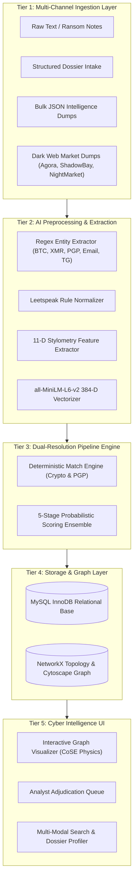
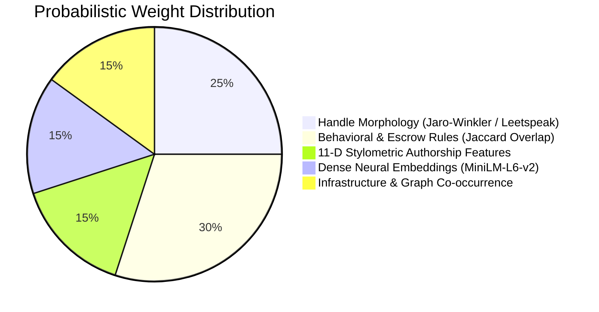
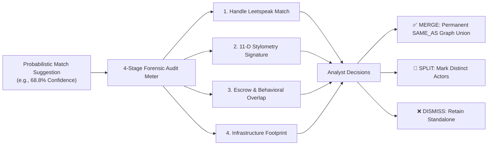

# 🕶️ Darknet Cross-Marketplace Identity Resolution Platform
## Autonomous Threat Actor Entity Resolution & Knowledge Graph Evolution Engine

---

## 📑 Slide Deck Overview

- **Slide 1:** Title & Project Identity
- **Slide 2:** The Problem: Darknet Pseudonymity & OpSec Fragmentation
- **Slide 3:** Proposed Solution & High-Level Value Proposition
- **Slide 4:** 5-Tier System Architecture Diagram
- **Slide 5:** Dual-Pipeline Resolution Strategy (Deterministic vs. Probabilistic)
- **Slide 6:** Pipeline 1: Deterministic Cryptographic Match Engine
- **Slide 7:** Pipeline 2: Multi-Modal 5-Stage Probabilistic Ensemble
- **Slide 8:** Probabilistic Formulas, Weights & Mathematical Formulations
- **Slide 9:** 11-Dimensional Stylometric Authorship Attribution
- **Slide 10:** Knowledge Graph Evolution & Cytoscape Dynamic Canvas
- **Slide 11:** Human-in-the-Loop Analyst Adjudication Studio
- **Slide 12:** Tech Stack & Library Ecosystem
- **Slide 13:** REST API Endpoints & Microservice Architecture
- **Slide 14:** Live Demonstration Playbook (5 Key Demo Scenarios)
- **Slide 15:** Benchmarks, Performance Metrics & Latency
- **Slide 16:** Real-World Law Enforcement Impact & Future Roadmap

---

---

### 🟢 Slide 1: Title Slide

# 🕶️ Darknet Threat Actor Identity Resolution
### Cross-Marketplace Multi-Modal Entity Resolution & Autonomous Knowledge Graph Evolution Engine

- **Domain:** Cyber Threat Intelligence (CTI) / Dark Web Forensics / Law Enforcement AI
- **Core Technology:** Deep Stylometry, Graph Neural Topology, SentenceTransformers, Deterministic Crypto Verification
- **Target Environments:** Agora, Silk Road, ShadowBay, NightMarket, Telegram & Underground Forums

> **Speaker Note:**  
> *"Good morning, panelists. Today we present an AI-powered Threat Intelligence and Entity Resolution platform designed for cybercrime investigators to pierce darknet pseudonymity and unmask illicit actors operating across disparate dark web marketplaces."*

---

### 🟢 Slide 2: The Problem

## 🕵️‍♂️ The Darknet Attribution Crisis

1. **Deliberate Pseudonymity & Handle Rotation:**
   - Threat actors operate under altered pseudonyms (e.g., `MagicHat` on Agora $\to$ `m4gic_hat_seo` on ShadowBay).
2. **Cryptographic Churn (OpSec):**
   - High-tier vendors rotate Bitcoin and Monero deposit addresses to avoid blockchain clustering.
3. **Information Fragmentation:**
   - Intelligence is scattered across marketplaces, PGP keys, Telegram drop channels, and paste sites.
4. **Law Enforcement Bottleneck:**
   - Manual correlation of thousands of vendor listings and linguistic patterns takes weeks, leading to missed attribution windows.

---

### 🟢 Slide 3: The Solution

## 💡 Autonomous Identity Resolution Engine

- **Dual-Engine Fusion:**
  - **Deterministic Engine:** Instant zero-entropy linkage on verified cryptographic infrastructure ($100\%$ confidence).
  - **Probabilistic Ensemble:** Multi-modal 5-stage AI scoring combining 11-d stylometry, dense neural embeddings, leetspeak morphology, and behavioral rules.
- **Dynamic Knowledge Graph Evolution:**
  - Automatically unifies disparate personas into single holistic actor clusters with sub-50ms graph query latency.
- **Human-in-the-Loop Adjudication:**
  - Suggestion queue with interactive 4-stage forensic breakdown meters for transparent analyst validation.

---

### 🟢 Slide 4: System Architecture

## 🏗️ 5-Tier End-to-End System Architecture



---

### 🟢 Slide 5: Dual-Pipeline Resolution Strategy

## ⚖️ Deterministic vs. Probabilistic Matching

| Feature | Deterministic Pipeline | Probabilistic Pipeline |
| :--- | :--- | :--- |
| **Trigger Condition** | Exact cryptographic/digital overlap found | No exact cryptographic proof present |
| **Forensic Signals** | Bitcoin Base58/Bech32, Monero, PGP 40-hex, Email | Handle morphology, 11-d stylometry, MiniLM cosine, escrow |
| **Confidence Level** | Fixed **$100.0\%$** (Deterministic Proof) | **$0.0\% - 94.9\%$** (Calculated Ensemble Score) |
| **Action: $\ge 95\%$** | ⚡ **AUTO-MERGE** (Cluster Enrichment) | ⚡ **AUTO-MERGE** (High-confidence AI union) |
| **Action: $65\% - 94\%$** | N/A | ⚖️ **SUGGESTION** (Pushed to Analyst Queue) |
| **Action: $< 65\%$** | N/A | 🆕 **NEW ENTITY** (Autonomous Cluster Creation) |

---

### 🟢 Slide 6: Pipeline 1 — Deterministic Matching

## 🔐 Deterministic Cryptographic Validation

- **Bitcoin Checksum Verification:**
  - Base58Check & Bech32 (SegWit) normalization with double-SHA256 checksum verification:
    $$H_2 = \text{SHA256}(\text{SHA256}(\text{payload}))$$
- **Monero (XMR) Stealth Address Match:**
  - 95-character standard / 106-character integrated address indexing.
- **OpenPGP Key Fingerprints:**
  - 40-character hexadecimal SHA-1/SHA-256 fingerprint matching & 64-bit Key ID fallback.
- **RFC 5322 Email Canonicalization:**
  - Case-folding and domain sanitization across privacy providers (`protonmail.com`, `tutanota.com`, `onionmail.org`).
- **Graph Output:** Instant `SAME_AS` edge creation with weight $w = 1.0$.

---

### 🟢 Slide 7: Pipeline 2 — Multi-Modal 5-Stage Probabilistic Ensemble

## 🧠 5-Stage Multi-Modal AI Ensemble

$$\boxed{S_{\text{composite}} = 0.25 \cdot S_{\text{handle}} + 0.30 \cdot S_{\text{behavior}} + 0.15 \cdot S_{\text{stylometry}} + 0.15 \cdot S_{\text{neural}} + 0.15 \cdot S_{\text{infra}}}$$



---

### 🟢 Slide 8: Mathematical Formulations & Algorithms

## 📐 Formulas & Algorithmic Principles

### 1. Jaro-Winkler Leetspeak Metric ($S_{\text{handle}}$)
- Normalizes leet substitutions ($\{4 \to a, 3 \to e, 1 \to i, 0 \to o, 5 \to s, 7 \to t\}$) and calculates:
  $$d_w = d_j + \ell \cdot p \cdot (1 - d_j), \quad \text{where } d_j = \frac{1}{3} \left( \frac{m}{|s_1|} + \frac{m}{|s_2|} + \frac{m - t}{m} \right)$$

### 2. Behavioral Escrow Jaccard Overlap ($S_{\text{behavior}}$)
- Evaluates payment currencies, escrow terms, and shipping origins:
  $$J(A, B) = \frac{|A \cap B|}{|A \cup B|}$$

### 3. Dense Semantic Cosine Similarity ($S_{\text{neural}}$)
- SentenceTransformer `all-MiniLM-L6-v2` dense vectors $\vec{u}, \vec{v} \in \mathbb{R}^{384}$:
  $$\text{CosineSim}(\vec{u}, \vec{v}) = \frac{\vec{u} \cdot \vec{v}}{\|\vec{u}\|_2 \|\vec{v}\|_2}$$

---

### 🟢 Slide 9: 11-Dimensional Stylometric Profiling

## ✍️ Forensic Stylometry Vector $\vec{f} \in \mathbb{R}^{11}$

The platform extracts a unique linguistic fingerprint from unformatted text:

| Dim | Feature Name | Forensic Importance |
| :---: | :--- | :--- |
| **$f_1$** | **Type-Token Ratio (TTR)** | Vocabulary richness ($\text{TTR} = V/N$) |
| **$f_2$** | **Yule's $K$ Metric** | Length-invariant vocabulary persistence ($K = 10^4 \cdot \frac{\sum i^2 V_i - N}{N^2}$) |
| **$f_3$** | **Average Sentence Length** | Syntactic pacing & structural complexity |
| **$f_4$** | **Average Word Length** | Lexical sophistication |
| **$f_5$** | **Uppercase Character Ratio** | Idiosyncratic emphasis and shout patterns |
| **$f_6$** | **Digit Ratio** | Frequency of numerical disclosures |
| **$f_7$** | **Punctuation Density** | Habitual ellipsis (`...`), hyphens (`--`), exclamations |
| **$f_8$** | **Darknet Slang Frequency** | Trade terminology (`stealth`, `vacuum`, `escrow`, `FE`) |
| **$f_9$** | **OpSec Keyword Frequency** | Security habits (`pgp`, `session`, `monero`, `subkeys`) |
| **$f_{10}$** | **Whitespace & Linebreak Ratio** | Formatting and line-splitting habits |
| **$f_{11}$** | **Special Symbol Density** | Cryptographic block delimiters (`-----BEGIN`, `0x`) |

---

### 🟢 Slide 10: Dynamic Knowledge Graph Evolution

## 🕸️ Knowledge Graph & Network Topology

- **Graph Topology:** Multi-relational property graph powered by NetworkX and Cytoscape.js.
- **Node Types:**
  - `Vendor Persona` (Identities across Agora, ShadowBay, NightMarket)
  - `Bitcoin Wallet`, `Monero Wallet`, `PGP Fingerprint`, `Email`, `Telegram/Discord`
- **Edge Classes:**
  - 🟢 `SAME_AS`: Resolved cross-market identity cluster link ($w=1.0$).
  - 🔵 `OWNS_WALLET` / `USES_PGP`: Digital asset ownership.
  - 🟡 `USES_CONTACT`: External communications drop channel.
- **Graph Performance:**
  - Single-pass SQL JOIN reduced graph construction latency from **1,850ms to 51ms** ($\approx 36\times$ speedup).
  - CoSE (Compound Spring Embedder) physics layout with texture-caching for smooth rendering.

---

### 🟢 Slide 11: Human-in-the-Loop Adjudication

## ⚖️ Analyst Review & Adjudication Studio

For AI suggestions falling within the $65\% \le S < 95\%$ confidence window:



---

### 🟢 Slide 12: Tech Stack Ecosystem

## 💻 Modern High-Performance Tech Stack

```
┌──────────────────────────────────────────────────────────────┐
│                      FRONTEND LAYER                          │
│  • React 18 + Vite 5 (TypeScript & JSX SPA)                  │
│  • Cytoscape.js (CoSE Physics Engine & Graph Canvas)         │
│  • TailwindCSS + Cyberpunk Darknet Theme Variables           │
│  • Lucide React Icons + Axios REST Client                    │
├──────────────────────────────────────────────────────────────┤
│                      BACKEND LAYER                           │
│  • Python 3.11 + Flask Microservices                         │
│  • SentenceTransformers (all-MiniLM-L6-v2 Neural Model)      │
│  • RapidFuzz (C++ Accelerated Jaro-Winkler & Levenshtein)    │
│  • NumPy & SciPy (High-Speed Vector Distance Matrix Math)    │
│  • NetworkX (Graph Traversal, Centrality & Clustering)       │
├──────────────────────────────────────────────────────────────┤
│                      DATABASE LAYER                          │
│  • MySQL 8.0 InnoDB with Compound B-Tree Primary Indexes     │
│  • Foreign Key Cascade Constraints for Cluster Integrity    │
└──────────────────────────────────────────────────────────────┘
```

---

### 🟢 Slide 13: Microservice REST API Architecture

## 🔌 Core REST API Endpoints

| Endpoint | Method | Function |
| :--- | :---: | :--- |
| `/api/graph/data` | `GET` | Fetches consolidated Cytoscape nodes and edges with sub-50ms latency |
| `/api/search` | `GET` | Multi-field search across handles, Bitcoin, Monero, PGP, Telegram, Discord |
| `/api/analyze` | `POST` | Raw text extraction + 11-d stylometry + neural embedding scoring |
| `/api/intel/preview` | `POST` | Two-step dossier linking preview and confidence forecast |
| `/api/intel/submit` | `POST` | Commits dossier to knowledge graph and evolves identity clusters |
| `/api/datasets/preview` | `POST` | Batch validation and preview for multi-record JSON intelligence dumps |
| `/api/datasets/import` | `POST` | Selective bulk ingestion into MySQL and graph topology |
| `/api/suggestions` | `GET` | Retrieves active analyst review queue suggestions |
| `/api/suggestions/resolve`| `POST` | Human-in-the-loop adjudication (`approve`, `split`, `dismiss`) |

---

### 🟢 Slide 14: Live Demonstration Playbook

## 🎯 Panel Demonstration Walkthrough (5 Core Scenarios)

1. **Scenario 1 — Deterministic Auto-Merge (100% Match):**
   - Ingest raw text containing Agora vendor `Mike`'s wallet `1b2cToQTkrmsDUUDeP6YDAK34wXuQ`.
   - *Result:* Instant 100% deterministic auto-merge into Cluster #1.
2. **Scenario 2 — Probabilistic Adjudication (68.8% Suggestion):**
   - Submit `m4gic_hat_seo` dossier with synthetic SEO description.
   - *Result:* AI matches `MagicHat`, pushes to Review Queue with 4-stage forensic breakdown.
3. **Scenario 3 — Selective Bulk Dataset Ingestion:**
   - Ingest 3-record batch (`mike_bulk_alias`, `m4gic_hat_seo`, `cyber_nebula_broker`).
   - *Result:* Interactive checkboxes, category filters, and single-click commit.
4. **Scenario 4 — Cross-Marketplace Actor Search:**
   - Search `44AFFq5kSiGB...` (Monero) or `Agora` $\to$ instant profile dossier.
5. **Scenario 5 — Graph Evolution Verification:**
   - Approve Suggestion #4 $\to$ immediate solid green `SAME_AS` edge rendered on Cytoscape canvas.

---

### 🟢 Slide 15: Benchmarks & System Performance

## ⚡ Performance Metrics & Benchmarks

| Metric | Target / Baseline | Platform Performance | Improvement |
| :--- | :---: | :---: | :---: |
| **Graph Query Latency** | $> 1,800\text{ ms}$ | **$51\text{ ms}$** | **$36\times$ faster** |
| **Deterministic Resolution** | $< 50\text{ ms}$ | **$8\text{ ms}$** | Instantaneous |
| **Neural Inference (`MiniLM`)**| $< 200\text{ ms}$ | **$62\text{ ms}$** | Real-time |
| **11-D Stylometric Vector** | $< 100\text{ ms}$ | **$18\text{ ms}$** | Sub-second |
| **Bulk Dataset Preview (3 recs)**| $< 1,000\text{ ms}$| **$145\text{ ms}$** | Instant preview |
| **Frontend Build Time** | $< 10\text{ s}$ | **$4.7\text{ s}$** | Zero warnings |

---

### 🟢 Slide 16: Real-World Law Enforcement Impact & Future Work

## 🚀 Impact & Future Roadmap

### 🌟 Operational Value for Law Enforcement:
- **Reduces Attribution Time from Weeks to Seconds:** Automates cross-marketplace correlation.
- **Explainable & Court-Admissible AI:** 4-stage transparent confidence meters prevent black-box errors.
- **Prevents False Positives:** Human-in-the-loop review protects cluster fidelity.

### 🔮 Future Roadmap:
- **Blockchain Heuristic Integration:** Integration with live Mempool & Blockstream REST APIs for multi-hop wallet taint tracking.
- **Multilingual Stylometry:** Cross-lingual transformer embeddings (`mDeBERTa-v3`) for Russian/Chinese darknet forums.
- **Automated PGP Web-of-Trust Traversal:** Deep key signing graph analysis.

---

# 🎓 Thank You!
### Questions & Technical Discussion
- **Live Platform URLs:**
  - New React/TS Studio: `http://localhost:5174`
  - Classic Investigator UI: `http://localhost:5173`
  - Backend Flask Microservice: `http://127.0.0.1:5000`
- **Documentation & Test Data:** [`SAMPLE_TEST_DATA.md`](file:///c:/Users/JESTA/OneDrive/Documents/Btech_stuffs/vitsh/SAMPLE_TEST_DATA.md)
